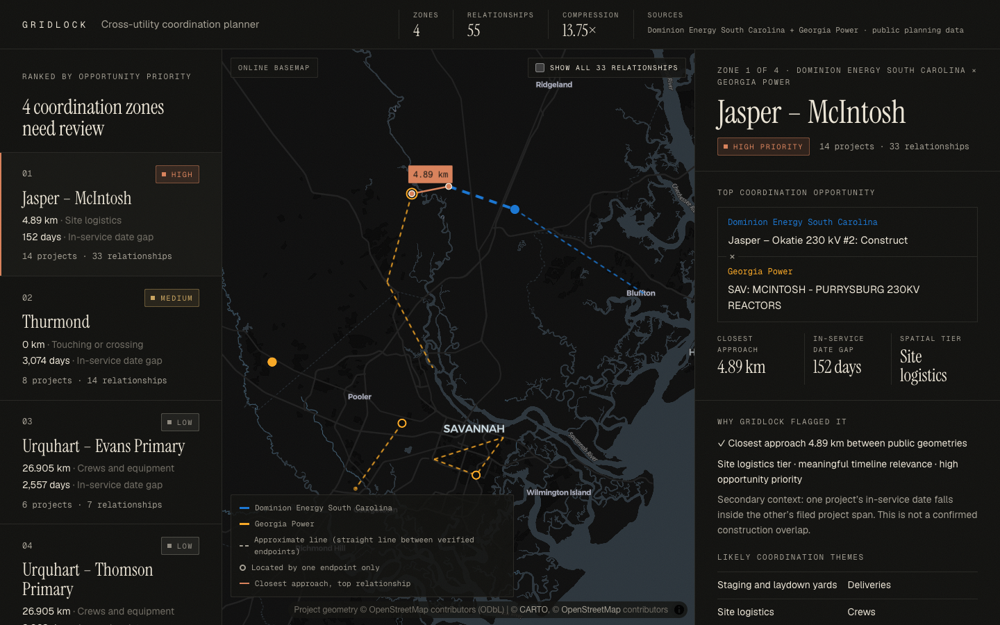

<div align="center">
  <h1>GridLock</h1>
</div>

<div align="center">
  <h3>Neighbouring utilities' transmission plans, compared for you — 55 pairwise alerts become 4 conversations worth having.</h3>
</div>

<div align="center">
  
  
  
  
  
</div>

<br>

<div align="center">
  
</div>

<br>

GridLock reads the public construction plans of two neighbouring
utilities — Dominion Energy South Carolina and Georgia Power — locates
each project on public OpenStreetMap infrastructure, measures the closest
approach and date gap between every cross-utility pair, and groups the
pairs that matter into ranked coordination zones. Every number is
reproducible and every result links back to its filing page.

```bash
cp .env.example .env
(cd backend && uv run gridlock run --offline --skip-ingest)   # build the payload
(cd backend && uv run gridlock serve)                         # terminal 1: API on :8010
(cd frontend && pnpm install && pnpm dev)                     # terminal 2: UI on :3000
```

> [!NOTE]
> The raw utility PDFs are not in the repository. Everything above runs
> from the committed normalized records and OSM snapshot, with no network.
> See [re-ingesting from the PDFs](#4-optional-re-ingest-from-the-source-pdfs).

## Why use GridLock?

- **Compression, not more data** — 182 public projects produce 55
  cross-utility relationships; GridLock groups them into 4 zones
  (13.75×), ranked so the timely Savannah River situation comes first.
- **Closest points, not centres** — distances are geodesic between the
  nearest points of the two geometries, so a line passing a substation is
  measured where it passes, not from its midpoint.
- **Evidence you can open** — every project carries its filing, page, raw
  ID, matched OSM feature and a 100-point Evidence Quality score with ✓/△
  reasons; approximations are labelled, never hidden.
- **No AI in the decision path** — parsing is deterministic regex, and
  distance, tier, timeline, evidence, zones and ranking are fixed rules in
  config. The same inputs give byte-identical output.
- **Honest about unknowns** — projects that can't be located are "not
  spatially assessed", never "no overlap"; ambiguous matches are left
  unresolved rather than guessed.

```
public filings  →  normalize  →  OSM match  →  overlap  →  zones  →  planner
 (DESC + GPC)     (dates, IDs,   (vetoes,     (closest    (guarded   (map, timeline,
                   endpoints)    topology)    point, gap) groups)    evidence)
```

---

## Documentation

- **[docs/architecture.md](docs/architecture.md)** — stages, commands, the
  contract, and where each of the ten invariants is enforced and tested.
- **[docs/configuration.md](docs/configuration.md)** — every config
  section, utility-file key, override field and environment variable.
- **[docs/data-decisions.md](docs/data-decisions.md)** — the 26 judgment
  calls behind the numbers, each with its reason.
- **[docs/demo-script.md](docs/demo-script.md)** — the three-minute demo,
  quoting only on-screen figures.
- **[docs/acceptance.md](docs/acceptance.md)** — the V1 acceptance
  checklist with the test or check that proves each item.
- **[docs/BUILD_PLAN.md](docs/BUILD_PLAN.md)** and
  **[docs/GRIDLOCK_BUILD_HANDOFF.md](docs/GRIDLOCK_BUILD_HANDOFF.md)** —
  the phase plan and the original product brief.

## Directory layout

```
GridLock/
├── .env.example              API and frontend settings (copy to .env)
├── config/
│   ├── gridlock.yaml         every threshold, rule, weight, label and limit
│   ├── utilities/            one file per utility (aliases, service area, sources)
│   └── overrides/            human-verified endpoint locations, with sources
├── backend/
│   ├── src/gridlock/
│   │   ├── ingestion/        PDF parsers and the Overpass cache
│   │   ├── normalization/    dates, voltages, IDs, endpoints
│   │   ├── georesolution/    OSM matching, vetoes, oracle check
│   │   ├── evidence/         Evidence Quality (handoff §10)
│   │   ├── overlap/          closest points, tiers, timeline
│   │   ├── graph/ ranking/ zones/ metrics/
│   │   ├── pipeline/         stage runner and payload assembly
│   │   ├── api/              read-only FastAPI
│   │   └── cli.py            the `gridlock` command
│   └── tests/                unit and integration (224 tests)
├── contract/                 generated JSON Schema of the payload
├── data/
│   ├── raw/                  source PDFs (gitignored; see Setup step 4)
│   ├── cache/                OSM snapshot with metadata and SHA-256
│   ├── normalized/           projects and resolved projects
│   ├── review/               unresolved endpoints, oracle comparisons
│   └── output/               relationships, gridlock.json, metrics.json
├── frontend/
│   ├── src/app/              `/` landing and `/planner`
│   ├── src/components/       zone rail, map, panel, timeline, evidence drawer
│   ├── src/lib/contract.ts   generated from the backend models
│   └── public/data/          bundled Census state boundaries (offline map)
└── docs/                     the documents listed above
```

### Why generated files are committed

`data/normalized`, `data/cache`, `data/output` and `contract/` are build
products, but they are committed on purpose: a fresh clone can run the
whole demo without the PDFs or a network, and a full pipeline run
reproduces every one of them byte-for-byte (an integration test checks
this). If a run changes them, something upstream changed.

### Why the map worker lives in `public/vendor`

MapLibre runs in an ES-module web worker that imports its shared chunk by
relative URL, which Next's bundler cannot rewrite; the symptom was
`Worker failed to load. Check that the worker URL is correct.` and an
empty map. `frontend/scripts/copy-maplibre-worker.mjs` copies the worker
from `node_modules` before every `dev` and `build`; the copies are
gitignored so they always match the installed version.

## Setup

Requires [uv](https://docs.astral.sh/uv/) (Python 3.12 is fetched for
you), Node 20.12 or newer (the frontend config uses `node:util`
`parseEnv`) and pnpm. Run every block from the repository root.

### 1. Settings

```bash
cp .env.example .env
```

One `.env` at the repository root serves both halves: the backend loads
it on start, and the frontend reads it through `frontend/next.config.ts`,
passing only `NEXT_PUBLIC_*` values to the browser. Real environment
variables win over the file; blank values mean "use the config default".
**Never commit `.env`.**

### 2. Build the payload

```bash
(cd backend && uv run gridlock run --offline --skip-ingest)
```

The summary ends with the zones and the reconciled coverage line
(`182 projects = 120 located … + 62 not assessed …`). **`git status`
should stay clean** — the run reproduces the committed outputs.

### 3. Start the API and the planner

`gridlock serve` keeps running, so use two terminals:

```bash
# terminal 1
(cd backend && uv run gridlock serve)            # API on :8010

# terminal 2
curl localhost:8010/api/health                   # {"service":"gridlock","status":"ok",…}
(cd frontend && pnpm install && pnpm dev)        # http://localhost:3000
```

### 4. (Optional) Re-ingest from the source PDFs

Place the two filings in `data/raw/` (or point `GRIDLOCK_RAW_DIR` at their
folder), then run without `--skip-ingest`:

```bash
(cd backend && uv run gridlock run --offline)
```

To refresh the OSM snapshot from Overpass (a live, rate-limited public
service), drop `--offline`.

### 5. Verify

```bash
(cd backend && uv run pytest)                    # 224 passed
(cd frontend && pnpm exec tsc --noEmit)
```

**Stop `pnpm dev` before `pnpm build`** — both write `frontend/.next`, and
a build under a running dev server breaks it ([symptom](#troubleshooting)).
To build alongside, prefix the build with `NEXT_DIST_DIR=.next-build`.

## Usage

Run these from `backend/` with `uv run`, e.g. `uv run gridlock inspect GPC-20277`.

| Command | When to use it | What it does |
|---|---|---|
| `gridlock run --offline [--skip-ingest]` | Normal build | Every stage in order, then prints the zone summary |
| `gridlock ingest plans` | New or changed PDFs | Parses filings into `data/normalized/projects.json` |
| `gridlock ingest osm [--offline]` | Refresh or inspect the OSM snapshot | Overpass pull, or re-reads the cache |
| `gridlock resolve` | After matching or override changes | Endpoint matches, geometry, Evidence Quality |
| `gridlock overlap` | After geometry changes | Cross-utility relationships |
| `gridlock payload` | After zone, priority or label changes | Graph, zones, ranking, `gridlock.json`, `metrics.json` |
| `gridlock oracle` | Sanity check | Compares with the sponsor's worked example |
| `gridlock inspect <id> [--resolved]` | Debugging a record | Prints one project |
| `gridlock contract export` | After model changes | Regenerates the schema and `contract.ts` |
| `gridlock serve` | Running the UI | Read-only API on `api.port` (or `GRIDLOCK_API_PORT`) |

Add `--log-level DEBUG` to any command for per-project match and evidence
lines on stderr.

## Known gaps

- **62 of 182 projects are not spatially assessed.** 59 name sites that
  OSM doesn't have under that name (only about a third of the region's
  OSM substations are named) and 3 name no site at all. Add confirmed
  locations to `config/overrides/geometry_overrides.yaml` with a public
  source; `data/review/unresolved.csv` lists every candidate.
- **Hooks and Purrysburg are still unresolved.** No public source found
  names their location, and the sponsor sheet has none either.
- **Geometry is approximate.** 54 of 55 relationships use a single
  endpoint or a straight line between endpoints, not a surveyed route;
  both are labelled in the UI.
- **No construction windows exist in the source data.** Timelines use
  in-service dates; Georgia Power's filed start→need spans are shown as
  context, never as construction overlap.
- **Three endpoints are ambiguous** — Lawrenceville and Coleman (twice)
  have equally good same-named substations far apart; they stay
  unresolved rather than guessed.
- **No cost or impact estimate.** Georgia Power's costs are all redacted;
  the handoff's S2 stretch goal stays locked.
- **The parsers follow these two documents' layouts.** Page ranges and
  field labels are in config, but a differently laid-out filing needs a
  new parser.
- **No WebGL, no map.** Some headless or locked-down browsers disable
  WebGL; the map says so and the rest of the planner keeps working.

## Troubleshooting

```bash
curl localhost:8010/api/health                              # is the API up, and is it GridLock?
lsof -nP -iTCP:8010 -sTCP:LISTEN                            # what owns the port?
(cd backend && uv run gridlock config show)                 # does config load?
(cd backend && uv run gridlock --log-level DEBUG resolve)   # per-project matching detail
```

**`GridLock data is unavailable. Could not reach a GridLock API at …`** —
the API isn't running, is on another port, or the page's origin isn't in
`api.cors_origins`. Start `gridlock serve`, or set
`GRIDLOCK_API_CORS_ORIGINS` when serving the UI from another port.

**`The server at … identifies as "…", not "gridlock"`** — another program
owns that port. Change `api.port` (or `GRIDLOCK_API_PORT`) and
`NEXT_PUBLIC_API_BASE_URL` together. Port 8000 was taken on the
development machine, which is why the default is 8010.

**`Missing frontend settings: NEXT_PUBLIC_API_BASE_URL …`** — there is no
`.env` at the repository root. `cp .env.example .env` and restart the
frontend.

**`raw planning documents are missing (…); rerun with --skip-ingest`** —
the PDFs aren't in `data/raw/`. Use `--skip-ingest`, or see Setup step 4.

**The dev server returns 404s for its own JavaScript** — something else
built into the same `.next` folder while it was running. Stop it, delete
`frontend/.next`, restart; to run a second build alongside, set
`NEXT_DIST_DIR`.

**The map badge says "Bundled basemap"** — the online style couldn't be
reached; this is the intended offline fallback, and distances and zones
are unaffected.

**`ai.enabled must be false`** — V1 has no AI extraction path; see
[docs/data-decisions.md](docs/data-decisions.md) decision 2.

## Uninstall

```bash
rm -rf backend/.venv frontend/node_modules frontend/.next frontend/public/vendor
rm -f .env
rm -rf data/raw          # only if you copied the PDFs in
```

Nothing is installed outside the repository apart from uv's and pnpm's
package caches.

## Architecture history

1. **AI-assisted extraction → deterministic regex only.** Every field in
   both filings is labelled; regex was simpler and reproducible, and AI
   was later ruled out of V1 entirely.
2. **Georgia Power start→need as a construction window → filed start plus
   in-service date.** Calling a filed span a construction window would
   have implied overlaps the data doesn't show (invariant I-6).
3. **Name-only OSM matching → vetoes plus topology.** Name matching alone
   placed Dawson, SC in Georgia and Grady in Florida; region, operator,
   voltage and endpoint-distance rules now reject those.
4. **Splitting zones by removing edges → partitioning relationships.**
   Edge removal dropped sponsor overlaps from every zone; growing zones
   from the strongest relationship keeps all 55.
5. **Timeline guard that splits → one that warns.** With 48 of 55
   relationships over a year apart, splitting gave 1.2× compression.
6. **Every crossing HIGH → untimely crossings MEDIUM.** A 0 km touch with
   dates 3,074 days apart was outranking the timely Savannah zone.
7. **Zone stats from mixed pairs → one headline relationship.** A card
   showed one pair's distance next to another pair's date gap.
8. **API on 8000 → 8010 with a service check.** Another local server on
   8000 would have fed the planner the wrong data silently.
9. **`@next/env` → `node:util` `parseEnv`.** Inside Next, `@next/env`
   returned its cached (empty) frontend env instead of reading the root
   `.env`.
10. **Validation-mode TypeScript types → serialization schema.** Fields
    the API always sends were typed as optional, and dictionaries lost
    their value types.
