<div align="center">
  <h1>GridLock</h1>
</div>

<div align="center">
  <h3>Two utilities' transmission plans, read side by side: 55 pairwise alerts become 4 conversations worth having, each traceable to the page it came from.</h3>
</div>

<div align="center">
  
  
  
  
  
</div>

<br>

<div align="center">
  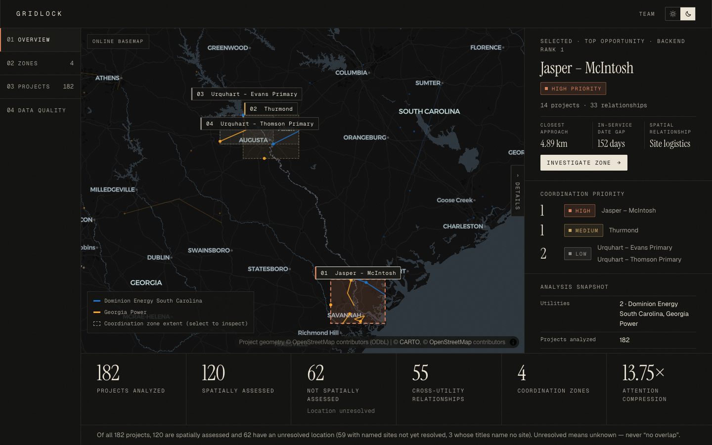
</div>

<br>

GridLock reads the public construction plans of two neighbouring
utilities, Dominion Energy South Carolina and Georgia Power. It locates
each project on public OpenStreetMap infrastructure and measures the true
closest approach and in-service date gap between every cross-utility
pair. The pairs that matter are grouped into ranked **coordination
zones**. Every number is reproducible, and every result links back to its
filing page. Built for the ShellHacks 2026 Sperry Tech challenge.

```bash
cp .env.example .env
(cd backend && uv run gridlock run --offline --skip-ingest)   # build the payload
(cd backend && uv run gridlock serve)                         # terminal 1: API on :8010
(cd frontend && pnpm install && pnpm dev)                     # terminal 2: UI on :3000
```

> [!NOTE]
> The raw utility PDFs are not in the repository. Everything above runs
> from the committed normalized records and OSM snapshot, with no network.
> See [re-ingesting from the PDFs](#4-optional-re-ingest-from-the-source-pdfs).

## What makes GridLock different

- **It measures real geometry, not centres.** Distances are geodesic,
  between the nearest points of the two projects' actual lines and
  substations. A line passing a substation is measured where it passes,
  not from its midpoint. The comparison below shows why this matters.
- **It compresses instead of piling on.** 182 public projects produce 55
  cross-utility relationships. GridLock groups them into 4 zones
  (**13.75×** less to look at), so a planner opens four conversations,
  not 55 alerts.
- **It ranks with judgment about time.** Spatial closeness comes first,
  then how close the dates are, then density. Thurmond touches at 0 km
  but its dates are 3,074 days apart, so it ranks below the timely
  Savannah River zone (4.89 km, 152 days) instead of crowding it out.
- **Evidence and priority are kept apart.** A 100-point Evidence Quality
  score says how well each location is supported, with ✓/△ reasons. It
  never changes a zone's priority, so a weakly evidenced crossing is
  still a crossing, flagged with a warning.
- **Every claim is one click from its source.** Each project carries its
  filing, page number, raw project ID, matched OSM feature, geometry
  method and approximations. The evidence drawer shows all of it.
- **No AI in the decision path.** Parsing is deterministic regex.
  Distance, tier, timeline, evidence, zones and ranking are fixed rules in
  `config/gridlock.yaml`. Rerunning the pipeline gives byte-identical
  output, and integration tests check exactly that.
- **Unknowns stay unknown.** 62 projects GridLock can't place are "not
  spatially assessed", never "no overlap". Ambiguous matches are left
  unresolved rather than guessed. The one human-verified location, Okatie,
  cites the public siting filing it came from.
- **It works in the room.** The whole demo runs offline on a bundled
  state-boundary map. The planner works in light or dark, on a laptop or a
  phone.

### Measured against the sponsor's worked example

The challenge came with a spreadsheet of six known overlaps, measured
centre to centre. GridLock uses it only as a test oracle
(`gridlock oracle`): it recovers all six, and finds 49 more.

| Pair | Sheet (centre to centre) | GridLock (closest points) | What changes |
|---|---|---|---|
| Hooks – Thurmond × Evans Primary – Thurmond Dam | 6.58 km | **0 km**, crossing | Both end at Thurmond Substation. The sheet's distance hides a shared endpoint. |
| Jasper – Okatie × McIntosh – Purrysburg | 9.09 km | **4.89 km**, site logistics | Under 8 km: a shared-yard, shared-delivery situation, not just a crew overlap. |
| Jasper – Okatie × Goshen – McIntosh | 12.15 km | **4.89 km**, site logistics | Same Savannah River cluster; it joins zone 1. |
| Stevens Creek – Hooks × Evans Primary – Thurmond Dam | 12.89 km | **10.893 km**, crews and equipment | |
| Okatie – Bluffton × McIntosh – Purrysburg | 23.08 km | **13.567 km**, crews and equipment | |
| Okatie – Bluffton × Goshen – McIntosh | 23.83 km | **13.567 km**, crews and equipment | |

Source: `data/review/oracle_overlaps.csv`. Date gaps match the sheet
exactly for all six.

```
public filings  →  normalize  →  OSM match  →  overlap  →  zones  →  planner
 (DESC + GPC)     (dates, IDs,   (vetoes,     (closest    (guarded   (overview, zones,
                   endpoints)    topology)    point, gap) groups)    projects, quality)
```

## The strongest finding

<div align="center">
  
</div>

<br>

On the Savannah River, Dominion's **Jasper – Okatie 230 kV #2** line and
Georgia Power's **McIntosh – Purrysburg 230 kV reactors** come within
**4.89 km**, measured closest point to closest point. Their in-service
dates are **152 days** apart. At that distance the coordination is *site
logistics*: shared staging yards, deliveries and crews. It anchors zone
1, where **14 projects** and **33 relationships** become one conversation.

## A tour of the planner

The planner has four sections. The section and the selected zone live in
the address (`/planner?view=zones&zone=ZONE-02`), so any screen can be
shared as a link.

<table>
  <tr>
    <td width="50%">
      <br>
      <b>Overview</b>: every coordination zone on one regional map.
      Select a zone to slide its details out, then use <i>Investigate
      zone →</i> to open it. The figures always show their denominators.
    </td>
    <td width="50%">
      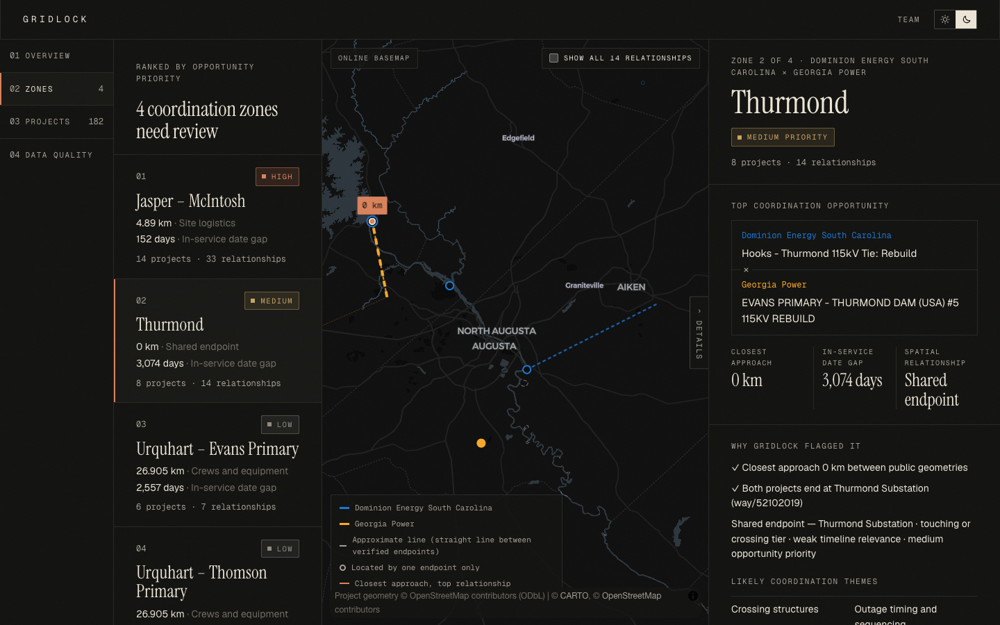<br>
      <b>Zones</b>: the investigation workspace. Thurmond reads
      <i>Shared endpoint — Thurmond Substation</i>, because both projects
      end at the same matched substation. The details column retracts so
      the map can go wide.
    </td>
  </tr>
  <tr>
    <td width="50%">
      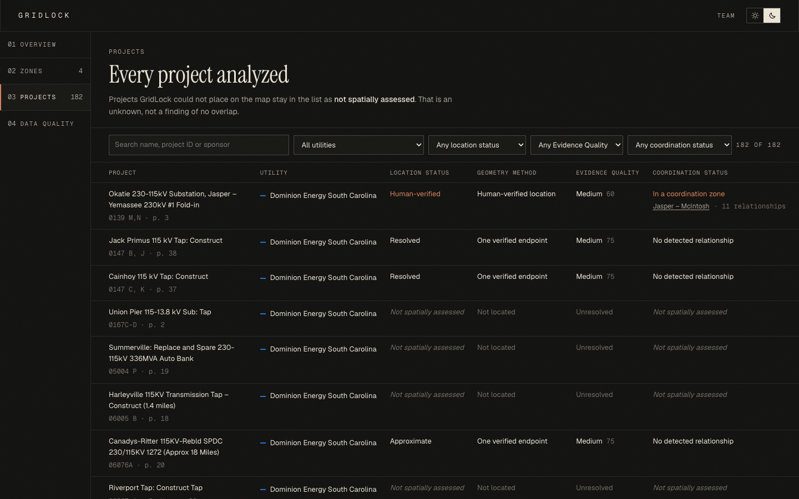<br>
      <b>Projects</b>: all 182 projects in one searchable register,
      filterable by utility, location status, Evidence Quality and
      coordination status. A row opens its evidence.
    </td>
    <td width="50%">
      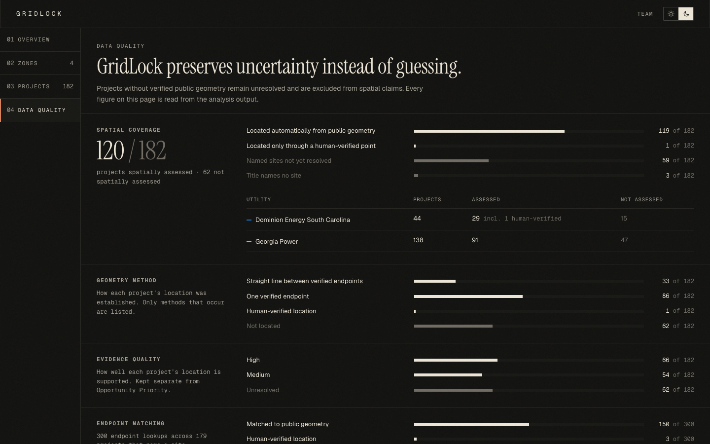<br>
      <b>Data quality</b>: what GridLock knows and how it knows it.
      Spatial coverage by utility, geometry methods, Evidence Quality,
      endpoint matching and source provenance, all read from the output.
    </td>
  </tr>
  <tr>
    <td width="50%">
      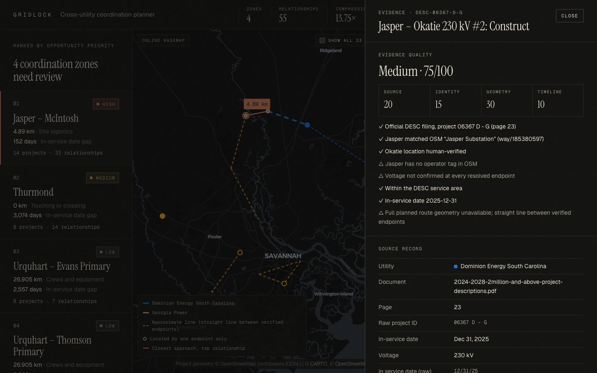<br>
      <b>Evidence drawer</b>: the audit record for one project. Filing,
      page 23, raw ID <code>06367 D - G</code>, matched OSM feature and a
      75/100 score with every reason and warning.
    </td>
    <td width="50%">
      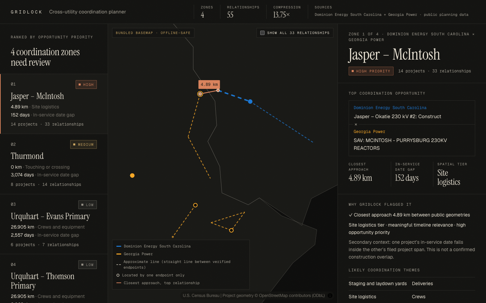<br>
      <b>Offline</b>: with no network, the map falls back to bundled
      Census state outlines within seconds. Geometry, distances and zones
      are unaffected.
    </td>
  </tr>
</table>

## Light and dark

Dark is the default. The sun / moon switch at the top right of every page
changes the theme, and the browser remembers the choice. The stored theme
applies before the page paints, so it never flashes. Both maps restyle,
online and offline.

<table>
  <tr>
    <td width="50%">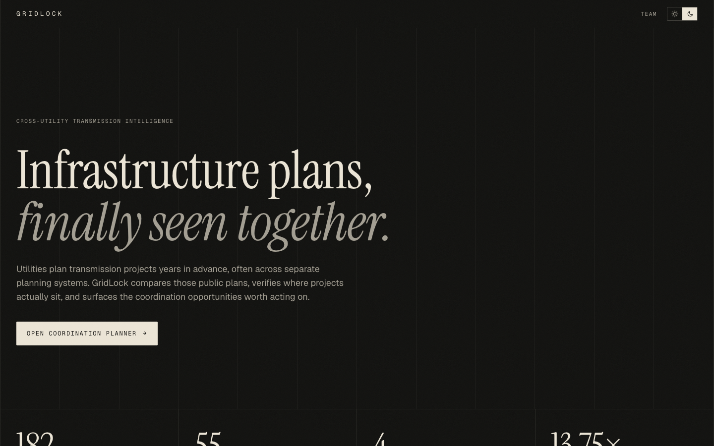</td>
    <td width="50%">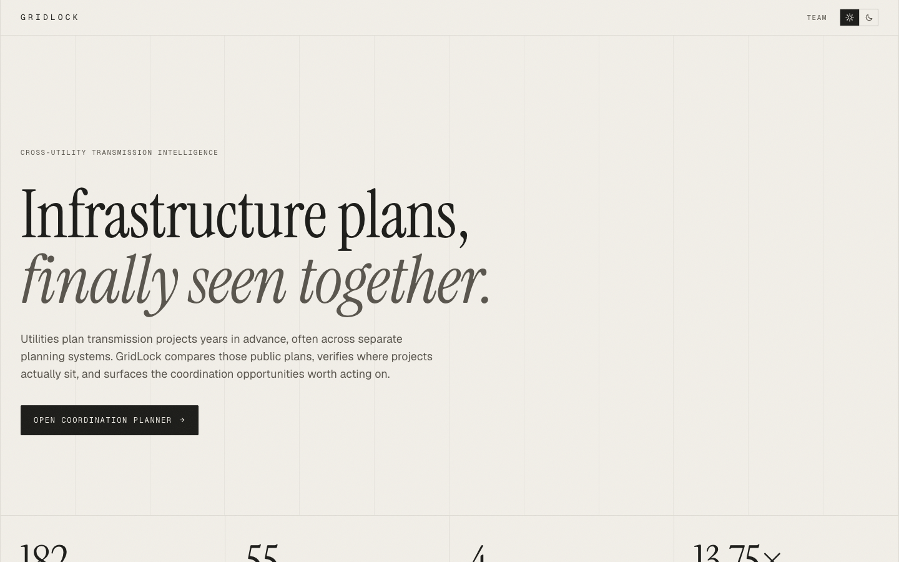</td>
  </tr>
  <tr>
    <td width="50%">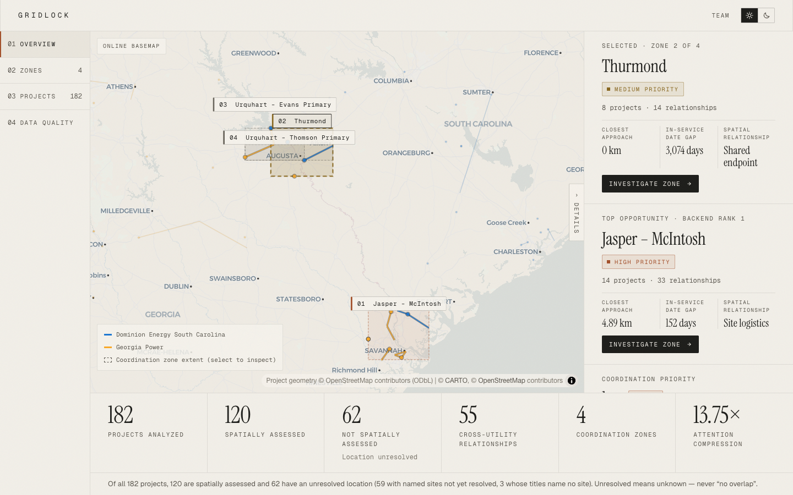</td>
    <td width="50%">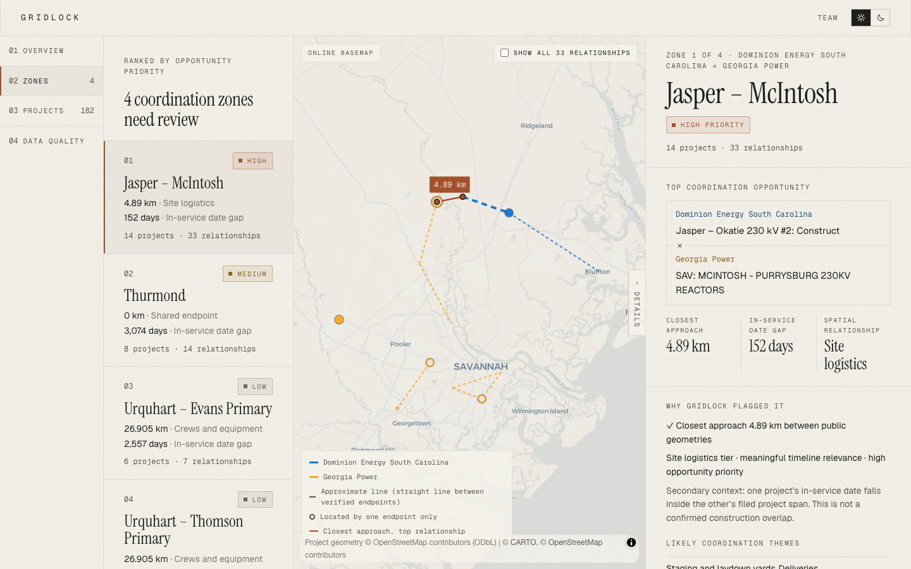</td>
  </tr>
</table>

<div align="center">
  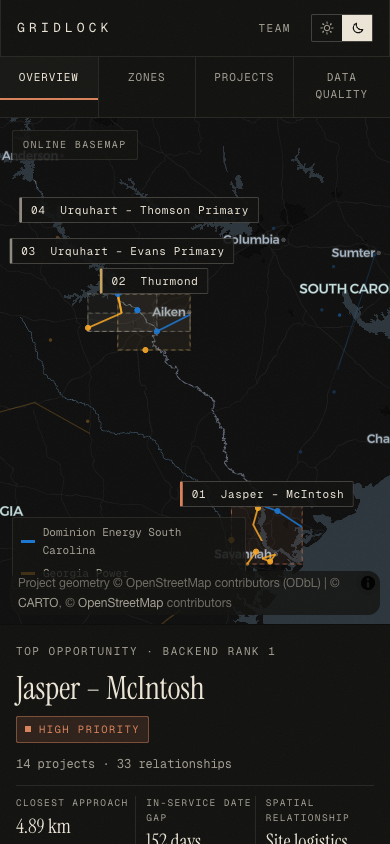
  &nbsp;&nbsp;
  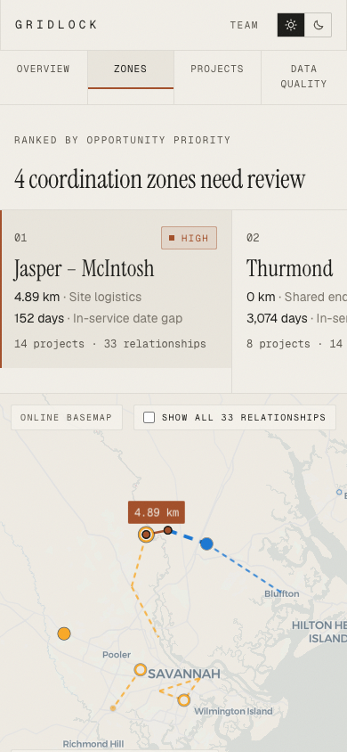
</div>

---

## Documentation

- **[docs/architecture.md](docs/architecture.md)**: stages, commands, the
  contract, the frontend, and where each of the ten invariants is
  enforced and tested.
- **[docs/configuration.md](docs/configuration.md)**: every config
  section, utility-file key, override field and environment variable.
- **[docs/data-decisions.md](docs/data-decisions.md)**: the 26 judgment
  calls behind the numbers, each with its reason.
- **[docs/demo-script.md](docs/demo-script.md)**: the three-minute demo,
  quoting only on-screen figures.
- **[docs/acceptance.md](docs/acceptance.md)**: the V1 acceptance
  checklist, with the test or check that proves each item.
- **[docs/BUILD_PLAN.md](docs/BUILD_PLAN.md)** and
  **[docs/GRIDLOCK_BUILD_HANDOFF.md](docs/GRIDLOCK_BUILD_HANDOFF.md)**:
  the phase plan and the original product brief.

## Directory layout

```
GridLock/
├── .env.example              API and frontend settings (copy to .env)
├── config/
│   ├── gridlock.yaml         every threshold, rule, weight, label and limit
│   ├── utilities/            one file per utility (aliases, service area, sources)
│   └── overrides/            human-verified endpoint locations, with sources
├── backend/
│   ├── src/gridlock/
│   │   ├── ingestion/        PDF parsers and the Overpass cache
│   │   ├── normalization/    dates, voltages, IDs, endpoints
│   │   ├── georesolution/    OSM matching, vetoes, oracle check
│   │   ├── evidence/         Evidence Quality (handoff §10)
│   │   ├── overlap/          closest points, tiers, timeline
│   │   ├── graph/ ranking/ zones/ metrics/
│   │   ├── pipeline/         stage runner and payload assembly
│   │   ├── api/              read-only FastAPI
│   │   └── cli.py            the `gridlock` command
│   └── tests/                unit and integration (224 tests)
├── contract/                 generated JSON Schema of the payload
├── data/
│   ├── raw/                  source PDFs (gitignored; see Setup step 4)
│   ├── cache/                OSM snapshot with metadata and SHA-256
│   ├── normalized/           projects and resolved projects
│   ├── review/               unresolved endpoints, oracle comparisons
│   └── output/               relationships, gridlock.json, metrics.json
├── frontend/
│   ├── src/app/              `/` landing, `/planner` and `/team`
│   ├── src/components/       planner views (overview, zones, projects, data
│   │                         quality), maps, evidence drawer, site nav
│   ├── src/content/team.ts   the people listed on `/team`
│   ├── src/lib/contract.ts   generated from the backend models
│   └── public/data/          bundled Census state boundaries (offline map)
└── docs/                     the documents listed above; screenshots in docs/assets
```

### Why generated files are committed

`data/normalized`, `data/cache`, `data/output` and `contract/` are build
products, but they are committed on purpose. A fresh clone can run the
whole demo without the PDFs or a network, and a full pipeline run
reproduces every one of them byte-for-byte (an integration test checks
this). If a run changes them, something upstream changed.

### Why the frontend holds no analysis

The browser only displays what the payload says. Thresholds, labels,
utility colours and units arrive in `payload.metadata`, and the only
display inference is "Shared endpoint", shown when both projects matched
the same public feature at the contact point. Both themes come from one
set of CSS tokens in `frontend/src/app/globals.css`, so a new theme is a
set of values, not a second stylesheet.

### Why the map worker lives in `public/vendor`

MapLibre runs in an ES-module web worker that imports its shared chunk by
relative URL, which Next's bundler cannot rewrite. The symptom was
`Worker failed to load. Check that the worker URL is correct.` and an
empty map. `frontend/scripts/copy-maplibre-worker.mjs` copies the worker
from `node_modules` before every `dev` and `build`. The copies are
gitignored, so they always match the installed version.

## Setup

Requires [uv](https://docs.astral.sh/uv/) (it fetches Python 3.12 for
you), Node 20.12 or newer (the frontend config uses `node:util`
`parseEnv`) and pnpm. Run every block from the repository root.

### 1. Settings

```bash
cp .env.example .env
```

One `.env` at the repository root serves both halves. The backend loads
it on start, and the frontend reads it through `frontend/next.config.ts`,
passing only `NEXT_PUBLIC_*` values to the browser. Real environment
variables win over the file, and blank values mean "use the config
default". The two basemap URLs (`NEXT_PUBLIC_MAP_STYLE_URL` for dark,
`NEXT_PUBLIC_MAP_STYLE_URL_LIGHT` for light) need no key. **Never commit
`.env`.**

### 2. Build the payload

```bash
(cd backend && uv run gridlock run --offline --skip-ingest)
```

The summary ends with the zones and the reconciled coverage line
(`182 projects = 120 located … + 62 not assessed …`). **`git status`
should stay clean**, because the run reproduces the committed outputs.

### 3. Start the API and the planner

`gridlock serve` keeps running, so use two terminals:

```bash
# terminal 1
(cd backend && uv run gridlock serve)            # API on :8010

# terminal 2
curl localhost:8010/api/health                   # {"service":"gridlock","status":"ok",…}
(cd frontend && pnpm install && pnpm dev)        # http://localhost:3000
```

### 4. (Optional) Re-ingest from the source PDFs

Place the two filings in `data/raw/` (or point `GRIDLOCK_RAW_DIR` at their
folder), then run without `--skip-ingest`:

```bash
(cd backend && uv run gridlock run --offline)
```

To refresh the OSM snapshot from Overpass (a live, rate-limited public
service), drop `--offline`.

### 5. Verify

```bash
(cd backend && uv run pytest)                    # 224 passed
(cd frontend && pnpm exec tsc --noEmit)
```

**Stop `pnpm dev` before `pnpm build`.** Both write `frontend/.next`, and
a build under a running dev server breaks it ([symptom](#troubleshooting)).
To build alongside, prefix the build with `NEXT_DIST_DIR=.next-build`.

## Usage

### Pipeline commands

Run these from `backend/` with `uv run`, e.g. `uv run gridlock inspect GPC-20277`.

| Command | When to use it | What it does |
|---|---|---|
| `gridlock run --offline [--skip-ingest]` | Normal build | Every stage in order, then prints the zone summary |
| `gridlock ingest plans` | New or changed PDFs | Parses filings into `data/normalized/projects.json` |
| `gridlock ingest osm [--offline]` | Refresh or inspect the OSM snapshot | Overpass pull, or re-reads the cache |
| `gridlock resolve` | After matching or override changes | Endpoint matches, geometry, Evidence Quality |
| `gridlock overlap` | After geometry changes | Cross-utility relationships |
| `gridlock payload` | After zone, priority or label changes | Graph, zones, ranking, `gridlock.json`, `metrics.json` |
| `gridlock oracle` | Sanity check | Compares with the sponsor's worked example |
| `gridlock inspect <id> [--resolved]` | Debugging a record | Prints one project |
| `gridlock contract export` | After model changes | Regenerates the schema and `contract.ts` |
| `gridlock serve` | Running the UI | Read-only API on `api.port` (or `GRIDLOCK_API_PORT`) |

Add `--log-level DEBUG` to any command for per-project match and evidence
lines on stderr.

### Planner pages

| Address | Shows |
|---|---|
| `/` | The landing page with the headline figures and the top finding |
| `/planner` | Overview: every zone on one map, figures along the bottom |
| `/planner?view=zones&zone=ZONE-01` | One zone: map, connector, why it was flagged, timeline, members |
| `/planner?view=projects` | Every project, searchable and filterable |
| `/planner?view=quality` | Coverage, geometry methods, Evidence Quality and provenance |
| `/team` | The people who built GridLock (from `frontend/src/content/team.ts`) |

## Known gaps

- **62 of 182 projects are not spatially assessed.** 59 name sites that
  OSM doesn't have under that name (only about a third of the region's
  OSM substations are named), and 3 name no site at all. Add confirmed
  locations to `config/overrides/geometry_overrides.yaml` with a public
  source; `data/review/unresolved.csv` lists every candidate.
- **Hooks and Purrysburg are still unresolved.** No public source found
  names their location, and the sponsor sheet has none either.
- **Geometry is approximate.** 54 of 55 relationships use a single
  endpoint or a straight line between endpoints, not a surveyed route.
  Both are labelled in the UI.
- **No construction windows exist in the source data.** Timelines use
  in-service dates. Georgia Power's filed start→need spans are shown as
  context, never as construction overlap.
- **Three endpoints are ambiguous.** Lawrenceville and Coleman (twice)
  each have equally good same-named substations far apart, so they stay
  unresolved rather than guessed.
- **No cost or impact estimate.** Georgia Power's costs are all redacted,
  so the handoff's S2 stretch goal stays locked.
- **The parsers follow these two documents' layouts.** Page ranges and
  field labels are in config, but a differently laid-out filing needs a
  new parser.
- **No WebGL, no map.** Some headless or locked-down browsers disable
  WebGL; the map says so and the rest of the planner keeps working.
- **Browser Back doesn't step between planner sections.** Sections replace
  the address rather than adding history entries. Switching theme also
  re-frames the maps.

## Troubleshooting

```bash
curl localhost:8010/api/health                              # is the API up, and is it GridLock?
lsof -nP -iTCP:8010 -sTCP:LISTEN                            # what owns the port?
(cd backend && uv run gridlock config show)                 # does config load?
(cd backend && uv run gridlock --log-level DEBUG resolve)   # per-project matching detail
```

**`GridLock data is unavailable. Could not reach a GridLock API at …`**:
the API isn't running, is on another port, or the page's origin isn't in
`api.cors_origins`. Start `gridlock serve`, or set
`GRIDLOCK_API_CORS_ORIGINS` when serving the UI from another port.

**`The server at … identifies as "…", not "gridlock"`**: another program
owns that port. Change `api.port` (or `GRIDLOCK_API_PORT`) and
`NEXT_PUBLIC_API_BASE_URL` together. Port 8000 was taken on the
development machine, which is why the default is 8010.

**`Missing frontend settings: NEXT_PUBLIC_API_BASE_URL …`**: there is no
`.env` at the repository root. Run `cp .env.example .env` and restart the
frontend.

**`raw planning documents are missing (…); rerun with --skip-ingest`**:
the PDFs aren't in `data/raw/`. Use `--skip-ingest`, or see Setup step 4.

**The dev server returns 404s for its own JavaScript**: something else
built into the same `.next` folder while it was running. Stop it, delete
`frontend/.next` and restart. To run a second build alongside, set
`NEXT_DIST_DIR`.

**The map badge says "Bundled basemap"**: the online style couldn't be
reached. This is the intended offline fallback, and distances and zones
are unaffected. In the light theme it also appears when
`NEXT_PUBLIC_MAP_STYLE_URL_LIGHT` is missing from an older `.env`; copy
that line from `.env.example`.

**`ai.enabled must be false`**: V1 has no AI extraction path; see
[docs/data-decisions.md](docs/data-decisions.md) decision 2.

## Uninstall

```bash
rm -rf backend/.venv frontend/node_modules frontend/.next frontend/public/vendor
rm -f .env
rm -rf data/raw          # only if you copied the PDFs in
```

Nothing is installed outside the repository apart from uv's and pnpm's
package caches. The theme choice is stored in the browser under
`gridlock-theme`.

## Architecture history

1. **AI-assisted extraction → deterministic regex only.** Every field in
   both filings is labelled; regex was simpler and reproducible, and AI
   was later ruled out of V1 entirely.
2. **Georgia Power start→need as a construction window → filed start plus
   in-service date.** Calling a filed span a construction window would
   have implied overlaps the data doesn't show (invariant I-6).
3. **Name-only OSM matching → vetoes plus topology.** Name matching alone
   placed Dawson, SC in Georgia and Grady in Florida; region, operator,
   voltage and endpoint-distance rules now reject those.
4. **Splitting zones by removing edges → partitioning relationships.**
   Edge removal dropped sponsor overlaps from every zone; growing zones
   from the strongest relationship keeps all 55.
5. **Timeline guard that splits → one that warns.** With 48 of 55
   relationships over a year apart, splitting gave 1.2× compression.
6. **Every crossing HIGH → untimely crossings MEDIUM.** A 0 km touch with
   dates 3,074 days apart was outranking the timely Savannah zone.
7. **Zone stats from mixed pairs → one headline relationship.** A card
   showed one pair's distance next to another pair's date gap.
8. **API on 8000 → 8010 with a service check.** Another local server on
   8000 would have fed the planner the wrong data silently.
9. **`@next/env` → `node:util` `parseEnv`.** Inside Next, `@next/env`
   returned its cached (empty) frontend env instead of reading the root
   `.env`.
10. **Validation-mode TypeScript types → serialization schema.** Fields
    the API always sends were typed as optional, and dictionaries lost
    their value types.
11. **One investigation screen → four planner sections.** The zone
    workspace showed where to look, but not the whole picture: what was
    analysed, what couldn't be placed, and how good the evidence was.
    Overview, Projects and Data quality answer those; Zones is the
    original workspace.
12. **"Touching or crossing" → "Shared endpoint".** Both 0 km
    relationships end at Thurmond Substation, and calling that a crossing
    undersold the finding. The backend tier is unchanged; the display
    names the shared feature.
